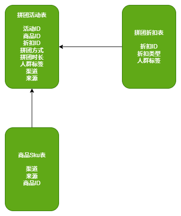

## 拼团交易系统

#### 库表设计（仅展示重要字段）

统一的商品库进行处理。那么后续谁要对接这个系统，就调用`sku`商品库，同步好商品即可。

#### 业务顺序图

#### 定义设计模式的通用结构模板和引入抽象模型

**策略映射器**：获取当前节点的`nextNode`

**异步查询数据**：将查询任务交给线程池，提高业务效率

**策略处理器**：当前节点的处理逻辑

节点流程如下：

