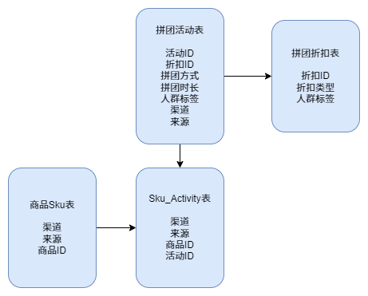
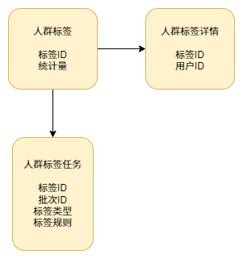
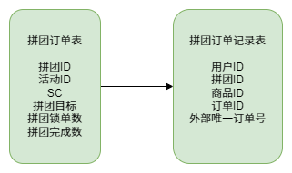
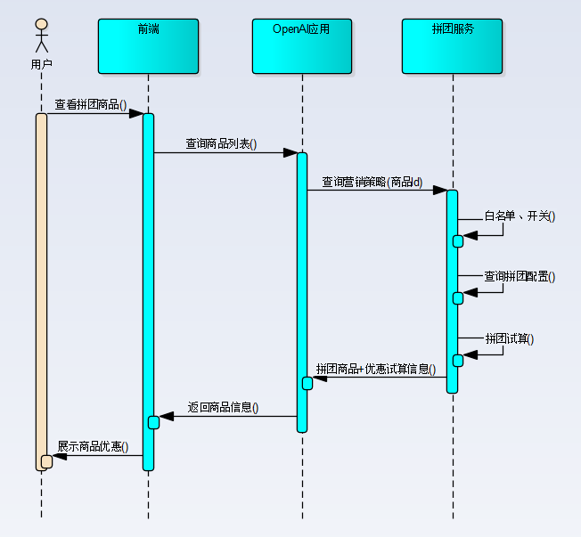

## 拼团交易系统

#### 拼团活动库表设计（仅展示重要字段）

统一的商品库进行处理。那么后续谁要对接这个系统，就调用`sku`商品库，同步好商品即可。

#### 人群标签库表设计（仅展示重要字段）

通过人群标签的过滤实现拼团活动对指定人群的开放，根据人群特点增加营销。

#### 拼团订单库表设计（仅展示重要字段）

拼团表 group_buy_order 除了有目标量（target_count）、完成量（complete），还要有一个锁单量（lock_count），当锁单量达到目标量后，用户在此组织下，不能在参与拼团。直至这些用户支付完成达成拼团或者锁单超时回退支付营销，空出可参与锁单量，这样其他用户可以继续参与。

#### 业务顺序图

